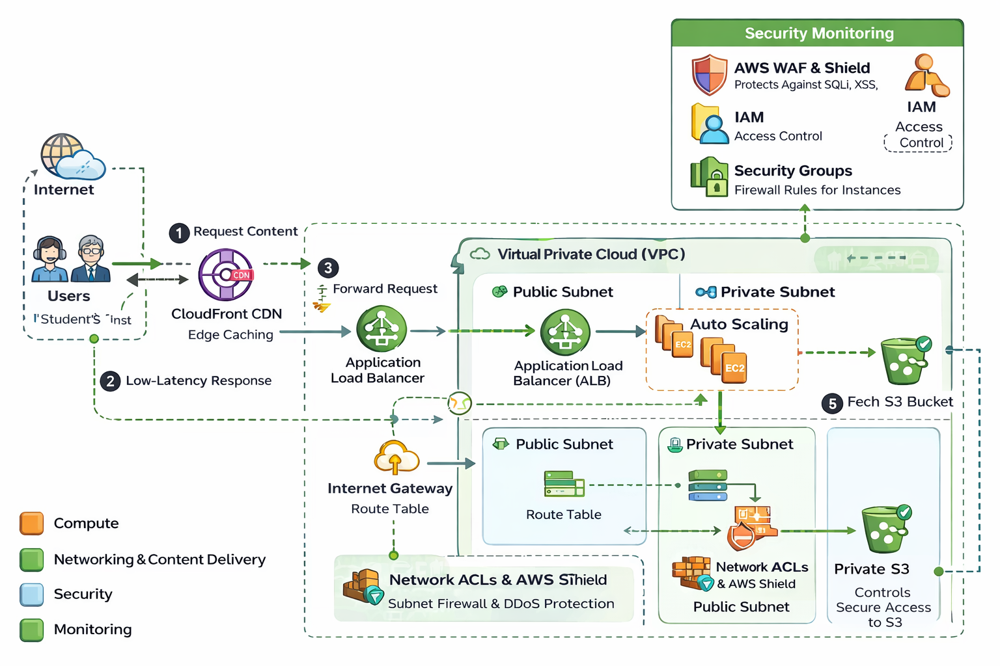

# ☁️ Scalable Online Learning Platform — AWS Architecture


---

## 📖 Project Overview

This project demonstrates the design and implementation of a **scalable, secure, and highly available AWS cloud architecture** for an online learning platform that delivers PDF files, Word documents, and blog content to students globally.

Online learning platforms often face sudden traffic spikes during peak periods (such as examinations), causing slow loading times and downtime. This solution leverages AWS cloud services to ensure:

* Low-latency content delivery
* Automatic scaling during high traffic
* High availability across zones
* Secure access to learning materials
* Cost-optimized infrastructure

---

## 🎯 Objectives

* Provide seamless access to learning materials
* Automatically scale during peak demand
* Ensure high availability with minimal downtime
* Secure content delivery and access control
* Monitor system performance in real time
* Optimize cost while maintaining performance

---

## 🏗️ Architecture Diagram



---

## 🔄 Architecture Workflow

1. Users request learning content via the internet
2. Requests reach **Amazon CloudFront CDN**
3. Cached content is served instantly (low latency)
4. Uncached requests go to **Application Load Balancer**
5. ALB distributes traffic across **Auto-Scaling EC2 instances**
6. EC2 retrieves static content from **Amazon S3**
7. Response returns through CloudFront to users

---

## ☁️ AWS Services Used

| Category       | Services                                     |
| -------------- | -------------------------------------------- |
| Compute        | EC2, Auto Scaling                            |
| Networking     | VPC, Subnets, Internet Gateway, Route Tables |
| Load Balancing | Application Load Balancer                    |
| Storage        | Amazon S3                                    |
| CDN            | CloudFront                                   |
| Security       | IAM, WAF, Shield, Security Groups, NACL      |
| Monitoring     | CloudWatch                                   |

---

## ⚙️ Implementation Steps

### 1️⃣ VPC Setup

* Created VPC `myProject`
* Public & Private subnets
* Internet Gateway attached
* Route tables configured

### 2️⃣ Security Configuration

* Security Groups for EC2
* Network ACL at subnet level
* IAM roles for secure access

### 3️⃣ EC2 Web Server

* Instance type: t2.micro
* Apache installed via user data
* Hosts learning platform

### 4️⃣ Load Balancer

* Application Load Balancer (internet-facing)
* Target group with EC2 instances
* Multi-AZ traffic distribution

### 5️⃣ Auto Scaling

* Launch template created
* Auto Scaling Group configured
* Scale based on CPU utilization

### 6️⃣ S3 Storage

* Bucket: `MyProject-content`
* Stores PDFs, docs, media
* Private access via policy

### 7️⃣ CloudFront CDN

* Distribution linked to S3
* Global edge caching
* Reduced latency worldwide

### 8️⃣ Monitoring

* CloudWatch metrics & alarms
* Auto Scaling triggers
* Instance health monitoring

---

## 🔐 Security Architecture

* IAM roles & policies
* Security Groups (instance firewall)
* Network ACL (subnet firewall)
* AWS WAF protection (SQLi, XSS)
* AWS Shield (DDoS protection)
* Private S3 bucket access
* CloudFront secure delivery

---

## 🚀 High Availability Design

* Multi-AZ Auto Scaling
* Load balancer failover
* S3 multi-AZ storage
* CloudFront global edge network
* Health checks & replacement

---

## 💰 Cost Optimization

* Free-tier EC2 (t2.micro)
* Auto Scaling reduces idle cost
* CloudFront caching lowers origin load
* S3 lifecycle policies
* On-demand scaling

---

## 🧪 Testing & Validation

* Access via ALB DNS
* Content delivery via CloudFront
* Auto Scaling trigger simulation
* Load distribution across instances
* S3 object retrieval tests

Result: Platform accessible, scalable, and fault-tolerant.

---

## 📊 Outcomes

* Scalable infrastructure
* Low-latency delivery
* High availability
* Secure content access
* Real-time monitoring
* Cost-efficient architecture

---

## 📂 Repository Structure

```
AWS-Online-Learning-Platform/
│
├── README.md
├── architecture-diagram.png
├── report.pdf
└── screenshots/
    ├── vpc.png
    ├── ec2.png
    ├── alb.png
    ├── autoscaling.png
    ├── s3.png
    └── cloudfront.png
```

---

## 🎓 Academic Context

Course: INT330 — Managing Cloud Solutions
Project: AWS Architecture for Online Learning Platform

---

## 📌 Conclusion

The AWS-based architecture successfully delivers a scalable, secure, and highly available online learning platform. By integrating EC2, Auto Scaling, ALB, S3, and CloudFront, the system ensures seamless access to educational content even during peak demand. The solution achieves performance optimization, fault tolerance, and cost efficiency while meeting all project objectives.

---

## 👨‍💻 Author

**Rohan Mishra**

---
